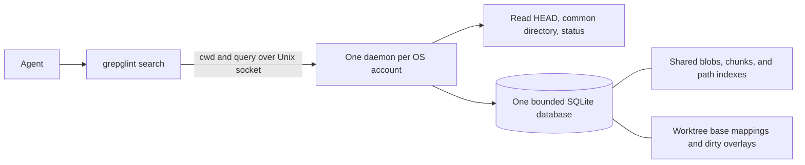

# Grepglint

Local code discovery for coding agents. Search for a concept, get a few likely
code regions, then use `rg` and file reads to inspect them.

```sh
grepglint search "refresh token validation"
grepglint search --json "webhook signature verification"
grepglint tools --json
```

The CLI and daemon are Rust. SQLite FTS5 supplies BM25 ranking. There are no
embeddings, network services, Git hooks, or filesystem watchers.

## Install

Requires Linux or macOS, Git, Rust 1.89 or later, and a C compiler for bundled
SQLite and tree-sitter. Linux is tested locally; CI also covers macOS.

```sh
git clone https://github.com/alundgren/grepglint.git
cd grepglint
cargo install --path . --locked
```

A proposed guided install/upgrade/verify/repair/uninstall flow is described in
[the installer investigation](docs/installer.md).

Run the binary from any directory inside a Git checkout, including regular
clones and linked worktrees. The first search starts the daemon and registers
that checkout. It exits after ten idle minutes.
The next search starts it again and reuses the on-disk cache. Agent sessions
need no lifecycle commands.

```text
1. src/auth/refresh-token.ts:7-14
   validateRefreshToken
   score: ...
      7 | export function validateRefreshToken(
      ...
```

Results default to five regions. `--limit 1` through `--limit 20` controls the
count, and `--stats` writes indexing counts to stderr. Each excerpt contains
at most eight lines and 1,000 characters. JSON keeps region and excerpt line
ranges separate and includes a content identity. Higher scores rank first;
scores are relative to the cache, not probabilities. Errors exit nonzero and
`--json` errors contain an `error` field.

## Maintenance

```sh
grepglint status
grepglint status --json
grepglint shutdown
# Refuse if another instance has replaced the daemon you inspected:
grepglint shutdown --instance <instance-from-status>
```

Status reports the running build, instance, and settings without starting a
missing daemon. JSON status returns `null` when none is running. Shutdown is
also successful when no daemon is running. It identifies the private socket's
OS-account owner and daemon instance, then requests a normal exit. It never
kills a recorded PID. The next search can start the daemon again.

Maintenance waits at most 35 seconds for exclusion and shutdown. Each control
exchange has a three-second deadline, so a busy daemon may refuse status.
Unknown or legacy protocols and stale or replaced sockets cause a refusal.
Pause searches and retry after the old daemon's idle exit; use `rg` while
waiting. These human maintenance commands stay outside `tools --json`.
See [the lock protocol](docs/architecture.md#daemon-maintenance) before adding
managed filesystem changes.

## Searchable files

Grepglint checks file contents rather than requiring a known extension.
UTF-8 text, including Razor, unfamiliar extensions, and extensionless files,
is searchable within the resource limits below. JavaScript and TypeScript use
syntax-aware chunks; other text uses overlapping line chunks. Binary content
containing NUL bytes and invalid UTF-8 are skipped. UTF-16 decoding is
[under consideration](https://github.com/alundgren/grepglint/issues/1).

Default exclusions cover `node_modules`, `vendor`, `dist`, `build`, `coverage`,
`target`, `.next`, and `.cache` directories, plus `pnpm-lock.yaml`,
`package-lock.json`, `yarn.lock`, `bun.lock`, and `Cargo.lock`.
To exclude additional paths or override those defaults, add `.grepglintignore`
at the checkout root. It uses Git ignore pattern syntax, including comments,
globs, root-anchored paths, and `!` inclusion rules:

```gitignore
# Exclude generated output from search.
/generated/
# Search this tracked dependency despite the default vendor exclusion.
!vendor/local-library/**
```

Rules apply to tracked and discovered untracked files in this worktree.
Inclusion rules do not discover Git-ignored untracked files or bypass binary,
encoding, size, or regular-file checks. `.git` and `.grepglintignore` itself
remain excluded. Changes to this file take effect on the next search, including
when the file is Git-ignored. Invalid rules fail the search instead of silently
using an incomplete rule set. Symlinked configuration files also fail the
search. The configuration is limited to 16 KiB and 256 lines to bound rule
compilation work.

JSON stats and `--stats` include `skip_reasons` counts such as `excluded_path`,
`binary`, `invalid_utf8`, `file_too_large`, and `line_too_long`. These describe
decisions made during that refresh, not all omitted files: cached content is
not checked again, and Git-ignored untracked files are never inspected.
Shared committed blobs are checked once per parser, so these counts are not a
count of unique repository paths. Unchanged searches report no new skips.
Dependency/generated-file classification and ranking are
[a separate investigation](https://github.com/alundgren/grepglint/issues/2).

## How it works



The canonical Git common directory identifies a repository. Different
worktrees share committed content; unrelated clones remain separate. A cache
entry uses the repository, blob SHA, and parser version. Paths have a separate
FTS index, so moving or copying a blob does not duplicate its code index.

Every query checks HEAD and Git status, plus inode, size, modification time,
and change time for dirty files. A changed HEAD triggers a tree diff. Missing
blobs are read in batches and parsed once. Dirty and untracked files have
worktree-local content identities. Overlay entries replace committed paths,
including deletion markers, and disappear when files return to HEAD content.
Only the active mappings contribute results. Cached history cannot appear by
itself. See [the architecture notes](docs/architecture.md) for ranking and
freshness details.

Amend, rebase, reset, and branch switches compare trees without assuming
ancestry. If the previous commit was pruned, Grepglint rereads the current tree
and reuses cached blobs. A refresh checks HEAD and dirty fingerprints again
before committing. If they changed, it rolls back and asks for a query retry.

## Resource limits

| Resource | Default policy |
| --- | --- |
| Database | 128 MiB hard page limit; rollback journal can temporarily use another 128 MiB |
| Disk reserve | Before cache writes, require room for twice the database limit plus 64 MiB |
| Memory | SQLite heap limited to 64 MiB; daemon address space limited to 512 MiB on Linux |
| Work | One request at a time; 30-second indexing/search budget; lower scheduling priority |
| Input | 16 KiB request; 250 ms receive deadline; 16 MiB per Git command output |
| Source | 512 KiB, 12,000 lines, and 4,000 bytes per line; 20,000 tracked/dirty paths |
| Output | 20 results maximum; 64 KiB response |
| Retention | Inactive worktrees expire after seven days; obsolete overlays are collected; cache pressure evicts older worktrees |
| Idle | No scanning or timer polling; daemon exits after ten minutes |

The cache lives in `$XDG_CACHE_HOME/grepglint` or `~/.cache/grepglint`. Its
directory is private and its socket has mode `0600`. No source or query logs
accumulate. A crash releases the OS lock; the next client recovers the stale
socket. Source files and the Git index are never written by Grepglint.

For experiments, `GREPGLINT_CACHE_DIR`, `GREPGLINT_CACHE_MB`, and
`GREPGLINT_IDLE_SECONDS` override those defaults. The running daemon keeps its
startup settings. These limits bound resource use, but do not make a cold
index free of CPU or disk activity. A repository that exceeds the limits needs
`rg`; Grepglint will not return an incomplete refreshed view.

## Agent instructions and validation

`grepglint tools --json` lists tools with their purpose, inputs, output, and
side effects. It lists repository search and output capture, paging, and purge without starting
the daemon. Future services can add subcommands and catalog entries. No routing framework is
needed for this prototype. Copy [the example instructions](examples/agent-instructions.md)
into an agent's repository instructions.

The repository pins Rust 1.89.0, Clippy, and rustfmt in `rust-toolchain.toml`.
With rustup, Cargo selects and installs that toolchain automatically so local
checks and CI use the same versions. Update the pin together with the release
toolchain when upgrading Rust.

```sh
cargo fmt --all -- --check
cargo test --locked --all-targets
cargo clippy --locked --all-targets -- -D warnings
cargo build --release --locked
python3 scripts/demo.py                  # requires Python 3 and rg
```

The demo creates disposable repositories, validates the eight core workflows,
and compares ranked search with literal and broader `rg` queries. See
[measured results and next experiments](docs/evaluation.md).

MIT licensed. The name combines grep with noticing something useful. Exact-name
web, GitHub, npm, and crates.io searches found no existing match when this
prototype was created.

## Retained tool output

`output bounce` is an opt-in experiment for finite UTF-8 logs, inside or outside
Git repositories. It reads stdout from the pipe. Use `2>&1` to merge stderr,
and enable your shell's `pipefail` to retain the producer's failure status:

```sh
set -o pipefail
cargo test 2>&1 | grepglint output bounce
grepglint output page <handle> --json
grepglint output page <handle> --json --cursor <next_cursor>
grepglint output purge
```

Accepted input through 4,096 bytes passes through byte for byte, including
ANSI sequences and the final newline state. This does not start a daemon or
create a cache. Larger input returns an immutable random handle, original
byte/line counts, and a head/tail preview bounded to 8 KiB including instructions.
A line is terminated by LF, with a final unterminated line counted once.
Previewing does not advance paging. Without a cursor, paging starts at byte zero.
Decode each JSON `content` and concatenate it until `end_of_output` is true;
this reconstructs the original UTF-8 bytes. Cursors can be repeated and are
bound to one handle and format version. Human-readable output escapes controls.
There is no relevance-search command for retained output yet.

Input containing NUL or invalid UTF-8 is rejected, even when the invalid bytes
arrive late. Failures can consume input, so you may need to rerun the producer.
Keep another copy of irreplaceable logs. A successful capture does not mean
the producer succeeded. Breaking the downstream pipe cancels ongoing capture;
a committed result whose preview cannot be delivered expires normally.

Output commands access a separate account-local store and do not contact the
search daemon, including an older or incompatible running daemon. Search's
16 KiB request and 64 KiB response protocol is unchanged. Output commands
never stop a process or inspect a PID to decide ownership. They hold the shared
maintenance lock while accessing output, so managed maintenance excludes them. Normal daemon
startup also attempts output cleanup; output corruption cannot disable search.

| Output resource | Default policy |
| --- | --- |
| Input | 8 MiB maximum; two captures; each reserves 8 MiB before storing bytes |
| Retention | 32 MiB payload including reservations, at most 64 entries; one-hour fixed TTL from capture creation |
| Pressure | Remove the oldest committed results when a reservation needs space; active captures remain reserved |
| Buffers | 3,584-byte read/chunk buffer; at most 32,256 pending bytes; 28,672-byte write batches |
| Preview | First/last 256 input bytes; at most 8 KiB after escaping and metadata |
| Page | At most 4,096 original bytes, preferring LF boundaries and preserving UTF-8; encoded output below 64 KiB |
| Disk | 40 MiB database plus at most 41 MiB rollback journal; under 4 KiB ownership metadata and fixed empty lock files |
| Reserve | Capture requires the existing twice-repository-database plus 64 MiB reserve and another 81 MiB; cleanup/purge need only the current output database size plus 1 MiB for rollback |
| Memory | 256 KiB SQLite page cache per output client; 64 MiB SQLite heap ceiling; bounded buffers; no whole-log allocation |
| Deadlines | 10 seconds without stdin, 120 seconds overall capture; two-second lock/database acquisition and output delivery waits |
| Maintenance | At most 64 output records and two capture slots; runs on startup and output requests, never idle polling |

Output bytes live in `output-v1` below the configured cache. The private
ownership record identifies the database, persistent journal, and capture locks
by device/inode. It is retained for reuse and future installer integration.
A private `output-gate` file records an unpredictable initialization directory
before its files are created. Incomplete initialization resumes on the next
output request; the complete directory is published with one rename. No
unrecorded directory is recursively removed.
Output does not evict repository cache entries. Staging uses the same database;
commit publishes metadata without copying the payload. Short transactions let
other clients progress while a producer pauses. OS locks release on exit or
crash, and the next output request removes abandoned captures.

Expiry is checked on every page and does not extend on access. Expired bytes
can remain on disk while Grepglint is idle, within the disk cap, until cleanup
or explicit purge. Pages validate the retained stream's digest before returning
content, and fail if the result disappeared or is corrupt. Each page reads at
most 8 MiB to verify integrity. A read transaction prevents eviction halfway
through a page; a later page may fail if the output was evicted in between.

`output purge` erases retained contents and clears the journal while preserving
repository caches, unknown files, and the empty bounded store/ownership record.
It waits at most two seconds per capture slot and fails while a capture remains
active. Retry after that capture finishes. Repeated purge is safe. Replaced or
unsafe files are preserved and cause an error; inspect those files rather than
recursively deleting a cache directory. Isolation is between OS accounts, not
between sessions of the same account. No power-loss durability guarantee is
added. See [output measurements](docs/output-measurements.md) for observations.
