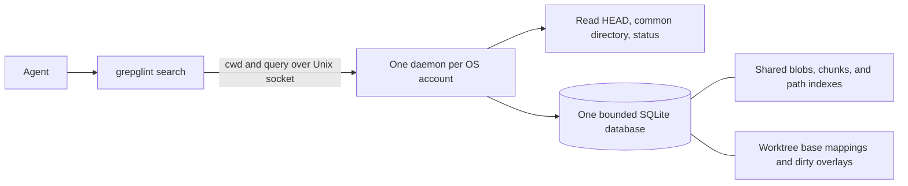

# Grepglint

Local code discovery for coding agents. Find likely implementation regions from
related words or identifiers when you have no focused file, or when broad text
search returns too many matches. Tool use is optional. Use compact queries such
as `migration dependency graph` or `request middleware exception`, without
regex or FTS operators.

Results are lexical suggestions, not exhaustive references or guaranteed
answers. Read the relevant regions to verify them. Use `rg` for exact strings,
regex, or all occurrences; directly read a file when its location is known.
The first search builds a bounded local index and may take several seconds.
If indexing fails, use `rg` and file reads. Repeating the same query will not
fix a capacity failure. Repository files remain unchanged and search uses no
network.

```sh
grepglint search "refresh token validation"
grepglint search --json "webhook signature verification"
grepglint tools --json
```

The CLI and daemon are Rust. SQLite FTS5 supplies BM25 ranking. There are no
embeddings, network services, Git hooks, or filesystem watchers.

## Install

The [release contract](docs/releases.md) describes raw binaries for Linux
x86_64 and macOS Apple Silicon, supported runtime baselines, prerequisites,
and verification tied to the selected release tag and source commit. The first
published release and hosted verification remain a human release task.

From a trusted checkout, `./install install --release v0.1.0` downloads and
verifies a selected published release before execution. `./install verify`
checks a managed installation offline using its retained maintenance copy.
Python 3, Git and authenticated gh 2.80.0 or newer are needed for initial
release installation. See [managed installation](docs/installer.md#managed-installation)
for consent, recovery, paths and limits. Use `./install upgrade --release vX.Y.Z`
to replace a release and `./install repair` to recover interrupted operations or
restore missing owned executables. `./install uninstall --yes` retains cached
source contents and offline maintenance. `./install purge --purge-cache` erases
recorded cached source contents with separate consent. Both run locally without
gh or network. See the removal and recovery details in the installer guide.

For source development, use Linux or macOS, Git, Rust 1.89 or later, and a C compiler for bundled
SQLite and tree-sitter. Linux is tested locally; CI also covers macOS.

```sh
git clone https://github.com/alundgren/grepglint.git
cd grepglint
cargo install --path . --locked
```

The [installer investigation](docs/installer.md) records the rationale and deferred lifecycle work.

Run the binary from any directory inside a Git checkout, including regular
clones and linked worktrees. The first search starts the daemon and registers
that checkout. It exits after ten idle minutes.
The next search starts it again and reuses the on-disk cache. Agent sessions
need no lifecycle commands.

```text
1. src/auth/refresh-token.ts:7-14
   validateRefreshToken
   score: ...
      7 | export function validateRefreshToken(
      ...
```

Results default to five regions. `--limit 1` through `--limit 20` controls the
count, and `--stats` writes indexing counts to stderr. Each excerpt contains
at most eight lines and 1,000 characters. JSON keeps region and excerpt line
ranges separate and includes a content identity. Higher scores rank first;
scores are relative to the cache, not probabilities. Errors exit nonzero and
`--json` errors contain an `error` field.

## Maintenance

```sh
grepglint status
grepglint status --json
grepglint shutdown
# Refuse if another instance has replaced the daemon you inspected:
grepglint shutdown --instance <instance-from-status>
```

Status reports the running build, instance, and settings without starting a
missing daemon. JSON status returns `null` when none is running. Shutdown is
also successful when no daemon is running. It identifies the private socket's
OS-account owner and daemon instance, then requests a normal exit. It never
kills a recorded PID. The next search can start the daemon again.

Maintenance waits at most 35 seconds for exclusion and shutdown. Each control
exchange has a three-second deadline, so a busy daemon may refuse status.
Unknown or legacy protocols and stale or replaced sockets cause a refusal.
Pause searches and retry after the old daemon's idle exit; use `rg` while
waiting. These human maintenance commands stay outside `tools --json`.
See [the lock protocol](docs/architecture.md#daemon-maintenance) before adding
managed filesystem changes.

## Searchable files

Grepglint checks file contents rather than requiring a known extension.
UTF-8 text, including Razor, unfamiliar extensions, and extensionless files,
is searchable within the resource limits below. JavaScript and TypeScript use
syntax-aware chunks; other text uses overlapping line chunks. Binary content
containing NUL bytes and invalid UTF-8 are skipped. UTF-16 decoding is
[under consideration](https://github.com/alundgren/grepglint/issues/1).

Default exclusions cover `node_modules`, `vendor`, `dist`, `build`, `coverage`,
`target`, `.next`, and `.cache` directories, plus `pnpm-lock.yaml`,
`package-lock.json`, `yarn.lock`, `bun.lock`, and `Cargo.lock`.
To exclude additional paths or override those defaults, add `.grepglintignore`
at the checkout root. It uses Git ignore pattern syntax, including comments,
globs, root-anchored paths, and `!` inclusion rules:

```gitignore
# Exclude generated output from search.
/generated/
# Search this tracked dependency despite the default vendor exclusion.
!vendor/local-library/**
```

Rules apply to tracked and discovered untracked files in this worktree.
Inclusion rules do not discover Git-ignored untracked files or bypass binary,
encoding, size, or regular-file checks. `.git` and `.grepglintignore` itself
remain excluded. Changes to this file take effect on the next search, including
when the file is Git-ignored. Invalid rules fail the search instead of silently
using an incomplete rule set. Symlinked configuration files also fail the
search. The configuration is limited to 16 KiB and 256 lines to bound rule
compilation work.

JSON stats and `--stats` include `skip_reasons` counts such as `excluded_path`,
`binary`, `invalid_utf8`, `file_too_large`, and `line_too_long`. These describe
decisions made during that refresh, not all omitted files: cached content is
not checked again, and Git-ignored untracked files are never inspected.
Shared committed blobs are checked once per parser, so these counts are not a
count of unique repository paths. Unchanged searches report no new skips.
Dependency/generated-file classification and ranking are
[a separate investigation](https://github.com/alundgren/grepglint/issues/2).

## How it works



The canonical Git common directory identifies a repository. Different
worktrees share committed content; unrelated clones remain separate. A cache
entry uses the repository, blob SHA, and parser version. Paths have a separate
FTS index, so moving or copying a blob does not duplicate its code index.

Every query checks HEAD and Git status, plus inode, size, modification time,
and change time for dirty files. A changed HEAD triggers a tree diff. Missing
blobs are read in batches and parsed once. Dirty and untracked files have
worktree-local content identities. Overlay entries replace committed paths,
including deletion markers, and disappear when files return to HEAD content.
Only the active mappings contribute results. Cached history cannot appear by
itself. See [the architecture notes](docs/architecture.md) for ranking and
freshness details.

Amend, rebase, reset, and branch switches compare trees without assuming
ancestry. If the previous commit was pruned, Grepglint rereads the current tree
and reuses cached blobs. A refresh checks HEAD and dirty fingerprints again
before committing. If they changed, it rolls back and asks for a query retry.

## Resource limits

| Resource | Default policy |
| --- | --- |
| Database | 256 MiB hard page limit; rollback journal can temporarily use another 256 MiB |
| Disk reserve | Before cache writes, require room for twice the database limit plus 64 MiB, 576 MiB by default |
| Memory | SQLite heap limited to 64 MiB; daemon address space limited to 512 MiB on Linux |
| Work | One request at a time; 30-second indexing/search budget; lower scheduling priority |
| Input | 16 KiB request; 250 ms receive deadline; 16 MiB per Git command output |
| Source | 512 KiB, 12,000 lines, and 4,000 bytes per line; 20,000 tracked/dirty paths |
| Output | 20 results maximum; 64 KiB response |
| Retention | Inactive worktrees expire after seven days; obsolete overlays are collected; cache pressure evicts older worktrees |
| Idle | No scanning or timer polling; daemon exits after ten minutes |

The cache lives in `$XDG_CACHE_HOME/grepglint` or `~/.cache/grepglint`. Its
directory is private and its socket has mode `0600`. No source or query logs
accumulate. A crash releases the OS lock; the next client recovers the stale
socket. Source files and the Git index are never written by Grepglint.

For experiments, `GREPGLINT_CACHE_DIR`, `GREPGLINT_CACHE_MB`, and
`GREPGLINT_IDLE_SECONDS` override those defaults. The running daemon keeps its
startup settings. These limits bound resource use, but do not make a cold
index free of CPU or disk activity. A repository that exceeds the limits needs
`rg`; Grepglint will not return an incomplete refreshed view.

Newly indexed source chunks use Zstandard level 1 compression automatically.
Chunks shorter than 256 bytes or without a size reduction remain raw. FTS
postings stay uncompressed, and only chunks selected for search results are
decompressed.

Cache format 3 adds per-chunk encoding and length fields to the deduplicated
FTS storage. On first use, the daemon recognizes version-1 and version-2 caches,
discards the old database under its writer lock, and rebuilds from the current
checkout. It keeps no backup copy. Unknown versions and unrecognized legacy
schemas are preserved and refused. Managed upgrades accept recognized legacy
caches; verification itself does not modify them. Older binaries cannot reuse
format 3.

## Agent instructions and validation

`grepglint tools --json` lists tools with their purpose, inputs, output, and
side effects. It lists repository search and output capture, search, paging, and purge without starting
the daemon. Future services can add subcommands and catalog entries. No routing framework is
needed for this prototype. Copy [the example instructions](examples/agent-instructions.md)
into an agent's repository instructions.

The repository pins Rust 1.89.0, Clippy, and rustfmt in `rust-toolchain.toml`.
With rustup, Cargo selects and installs that toolchain automatically so local
checks and both CI workflows use the same versions. Update this pin when
upgrading Rust.

```sh
cargo fmt --all -- --check
cargo test --locked --all-targets -- --quiet
cargo clippy --locked --all-targets -- -D warnings
cargo build --release --locked
python3 scripts/demo.py                  # requires Python 3 and rg
```

Rust's `-- --quiet` uses progress dots and a summary for each test executable,
with failure details still visible. Keep test output captured by default;
`--nocapture` and `--show-output` also print output from passing tests.
CI uses this terse format. For Python, `-q -b` prints a short summary and
buffers test output, showing it on failure:

```sh
python3 -m unittest discover -s scripts -p "test_*.py" -q -b
python3 -m unittest discover -s benchmarks/tests -q -b
```

See [Testing in AGENTS.md](AGENTS.md#testing) for single-test, module, and
multiple-test commands. Use focused runs while fixing a failure, then run the
relevant suites before finishing.

Normal tests exercise maintenance timeouts with short deadlines and real OS
locks and sockets. To also check the CLI's production 35-second timeout, run:

```sh
cargo test --locked --test maintenance maintenance_lock_acquisition_expires_without_stopping_daemon -- --ignored --exact --quiet
```

Development and test builds optimize the SHA-256 dependency because each daemon
startup hashes its executable, including debug information. Application code
keeps the default debug settings.

The demo creates disposable repositories, validates the eight core workflows,
and compares ranked search with literal and broader `rg` queries. See
[measured results and next experiments](docs/evaluation.md).

The [discovery corpus](docs/benchmark-corpus.md) provides 40 pinned-repository
questions, offline validation, source audits and a language-independent
[scoring contract](docs/benchmark-scoring.md). Its
[coverage report](docs/benchmark-coverage.md) includes cold-index failures.
The [Codex preflight](docs/benchmark-preflight.md) checks tool and instruction
isolation using the pinned client and a local stub without model inference.
The [stock-client verification](docs/benchmark-verification.md) adds Linux
source restrictions, a streaming call audit and a separately confirmed,
two-attempt ChatGPT smoke command. The approved real turns remain in issue #39.
The [paired runner](docs/benchmark-paired.md) compares native Codex exploration
with the same environment plus Grepglint. Offline proofs and simulated trials
need no account access. Separate ChatGPT readiness
and execution commands require one approval for an exact selected run.

Grepglint code is MIT licensed. Retained benchmark evidence keeps its upstream
licenses and notices. The name combines grep with noticing something useful. Exact-name
web, GitHub, npm, and crates.io searches found no existing match when this
prototype was created.

## Retained tool output

`output bounce` is an opt-in experiment for finite UTF-8 logs, inside or outside
Git repositories. It reads stdout from the pipe. Use `2>&1` to merge stderr,
and enable your shell's `pipefail` to retain the producer's failure status:

```sh
set -o pipefail
cargo test 2>&1 | grepglint output bounce
grepglint output search <handle> "NodePtyModuleLoadError node-pty" --json
grepglint output page <handle> --json
grepglint output page <handle> --json --cursor <next_cursor>
grepglint output purge
```

Accepted input through 4,096 bytes passes through byte for byte, including
ANSI sequences and the final newline state. This does not start a daemon or
create a cache. Larger input returns an immutable random handle, original
byte/line counts, and a head/tail preview bounded to 8 KiB including instructions.
A line is terminated by LF, with a final unterminated line counted once.
Previewing does not advance paging. Without a cursor, paging starts at byte zero.
Decode each JSON `content` and concatenate it until `end_of_output` is true;
this reconstructs the original UTF-8 bytes. Cursors can be repeated and are
bound to one handle and format version. Human-readable output escapes controls.
`output search` ranks one retained output with the same lexical expansion and
OR query rules as code search. It uses only that output's BM25 statistics.
Queries accept at most 2,000 bytes and use the first 32 distinct expanded terms
in lexical order. Results default to five, with `--limit 1` through `20`.
Each result includes original byte offsets, line ranges, a clipped excerpt and
a paging command positioned at that excerpt. Byte ranges are zero-based and
end-exclusive; line numbers are one-based. Long lines remain searchable and
can produce several regions on the same source line.

Try identifiers such as `NodePtyModuleLoadError`, `node-pty`, `linux-x64`,
`constructEvent`, `SQLITE_BUSY`, `v24.20.0`, or `src/auth/session.ts`. Expansion
and OR matching are not exact-match semantics. The best-ranked excerpt need
not contain the answer. Empty results include a command to page the original.
A poor query never removes the ability to retrieve omitted bytes.

Input containing NUL or invalid UTF-8 is rejected, even when the invalid bytes
arrive late. Failures can consume input, so you may need to rerun the producer.
Keep another copy of irreplaceable logs. A successful capture does not mean
the producer succeeded. Breaking the downstream pipe cancels ongoing capture;
a committed result whose preview cannot be delivered expires normally.

Capture, paging and purge access a separate account-local store directly and
do not contact a running daemon. Output search runs in the daemon to share its
existing memory and work limits with repository search. An older daemon may
reject output search; pause searches and retry after its idle exit, or page the
original immediately. Repository search's
16 KiB request and 64 KiB response protocol is unchanged. Capture, retrieval and purge commands never stop a process or inspect a PID
to decide ownership. `output exec` owns and cancels the process group it starts. They hold the shared
maintenance lock while accessing output, so managed maintenance excludes them. Normal daemon
startup also attempts output cleanup; output corruption cannot disable search.

| Output resource | Default policy |
| --- | --- |
| Input | 8 MiB maximum; two captures; each reserves 8 MiB before storing bytes |
| Retention | 32 MiB payload including reservations, at most 64 entries; one-hour fixed TTL from capture creation |
| Pressure | Remove the oldest committed results when a reservation needs space; active captures remain reserved |
| Buffers | 3,584-byte read/chunk buffer; at most 32,256 pending bytes; 28,672-byte write batches |
| Preview | First/last 256 input bytes; at most 8 KiB after escaping and metadata |
| Page | At most 4,096 original bytes, preferring LF boundaries and preserving UTF-8; encoded output below 64 KiB |
| Disk | 40 MiB database plus at most 41 MiB rollback journal, plus two command spools of at most 8 MiB each; under 4 KiB ownership metadata and fixed empty lock files |
| Reserve | Capture requires the existing twice-repository-database plus 64 MiB reserve and another 97 MiB; cleanup/purge need only the current output database size plus 1 MiB for rollback |
| Memory | Capture/page: 256 KiB SQLite page cache per client, 64 MiB SQLite heap ceiling, bounded buffers; search uses the daemon budget below |
| Bounce deadlines | 10 seconds without stdin, 120 seconds overall capture; two-second lock/database acquisition and output delivery waits |
| Maintenance | At most 64 output records and two capture slots; runs on startup and output requests, never idle polling |

Output bytes live in `output-v1` below the configured cache. The private
ownership record identifies the database, persistent journal, and capture locks
by device/inode. It is retained for reuse and future installer integration.
A private `output-gate` file records an unpredictable initialization directory
before its files are created. Incomplete initialization resumes on the next
output request; the complete directory is published with one rename. No
unrecorded directory is recursively removed.
Output does not evict repository cache entries. Staging uses the same database;
commit publishes metadata without copying the payload. Short transactions let
other clients progress while a producer pauses. OS locks release on exit or
crash, and the next output request removes abandoned captures.

Expiry is checked on every page and does not extend on access. Expired bytes
can remain on disk while Grepglint is idle, within the disk cap, until cleanup
or explicit purge. Pages validate the retained stream's digest before returning
content, and fail if the result disappeared or is corrupt. Each page reads at
most 8 MiB to verify integrity. A read transaction prevents eviction halfway
through a page; a later page may fail if the output was evicted in between.

`output purge` erases retained contents and clears the journal while preserving
repository caches, unknown files, and the empty bounded store/ownership record.
It waits at most two seconds per capture slot and fails while a capture remains
active. Retry after that capture finishes. Repeated purge is safe. Replaced or
unsafe files are preserved and cause an error; inspect those files rather than
recursively deleting a cache directory. Isolation is between OS accounts, not
between sessions of the same account. No power-loss durability guarantee is
added. See [output measurements](docs/output-measurements.md) for observations.

### Output search limits

Search verifies the full retained stream once in a read transaction, then builds
and drops an in-memory FTS5 database. It does not register a Git repository or
add output to the repository index. It creates no temporary disk index and
retains no search cache. The read transaction protects the complete result
against concurrent eviction or purge. Writers may receive the existing
two-second database-busy error while a search reads; retry after it finishes.
Expiry is checked before returning results and access does not extend it.

| Search resource | Bound |
| --- | --- |
| Source allocation | At most 8 MiB, validated UTF-8; other chunk text borrows that allocation |
| Generic chunks | At most 8,192 chunks; each at most 8,192 bytes and 60 LF-terminated lines; up to six lines and 1,024 bytes overlap, or 256 bytes inside a long line |
| Expansion | At most 64 KiB per chunk and 32 MiB total expanded text; lexical expansion works on one bounded chunk at a time |
| Temporary SQLite | At most 32 MiB logical database; in-memory only, including sort work; shares the daemon's existing 64 MiB total SQLite heap limit |
| Process/concurrency | One daemon request at a time, including repository and output searches; existing 512 MiB Linux address-space limit and lower scheduling priority |
| Work | 30-second work deadline covers store opening/lock waits/cleanup, retained chunks, ranking chunks, results and SQLite progress; request receipt and response delivery retain their separate deadlines |
| Results | At most 20, each excerpt at most 1,000 original bytes and eight lines; complete encoded response at most 64 KiB, including metadata and escaping |

The ranker searches every generated chunk or fails explicitly on a limit,
timeout, cancellation or SQLite allocation failure. It never reports a prefix
as a complete corpus. Extremely many short lines or a large vocabulary can
exceed the ranking budget even when capture accepted the output. Use exact
paging after such a failure. Human responses escape unsafe controls; JSON
contains exact excerpt text. Clipping flags describe text omitted within the
ranked chunk, while the top-level paging command starts the entire output.

The CLI checks for downstream closure while waiting and disconnects the socket.
The daemon checks that connection during traversal and ranking, so abandoned
searches release their temporary database. No producer runs in the daemon.
See [release search measurements](docs/output-search-measurements.md) for
scripted retrieval and resource observations. These are not agent-effectiveness
trials.

### Execute a command once

`output exec` is an experimental native command wrapper. It runs the selected
shell directly with `-c` and the command as one argument. The command runs once,
under the caller's existing permissions and resource limits. It runs in the CLI
process's child group, never in a hook or the search daemon.

```sh
grepglint output exec --shell /bin/bash --command 'set -o pipefail; cargo test 2>&1 | cat' \
  --cwd /path/to/project --env CARGO_TERM_COLOR=always --profile preview16k
```

Use it only for finite, noninteractive commands. Stdin is `/dev/null`. TTYs,
interactive input and persistent background services are unsupported. The
producer inherits the caller's environment, with repeatable `--env NAME=VALUE`
overrides. Shell quoting, pipelines and redirects belong to the selected shell;
Grepglint does not parse or rewrite them. Pipeline exit semantics also belong to
that shell, including whether `pipefail` is enabled.

Both stdout and stderr write to the same pipe. The captured stream is the byte
order the kernel delivers on that pipe, including controls and original line
endings. Writes within the platform's `PIPE_BUF` limit are atomic; larger writes
from concurrent processes can interleave. Application buffering can affect when
writes happen. Retrieval reconstructs this combined stream, without separate
stdout/stderr attribution. An explicit command redirect can send bytes elsewhere.

| Fixed profile | Initial response |
| --- | --- |
| `unchanged` | Stream every original byte directly and measure it; no capture or UTF-8 restrictions |
| `preview16k`, default | Pass through up to 16,384 bytes; retain larger accepted output |
| `preview32k` | Pass through up to 32,768 bytes; retain larger accepted output |

The two preview profiles differ only in threshold. They use the existing
first/last 256-byte excerpts, 8 KiB encoded preview ceiling, 4 KiB exact pages,
and on-demand search. The preview starts with an incomplete-output label,
producer status, original byte count, handle, expiry/eviction limitations and
copyable recovery commands. Small output passes through byte-for-byte at EOF.
A yielded native executor call can resume waiting on this same wrapper process;
accepted retained bytes are not emitted before the final preview.

If capture cannot start or fails after reading a prefix, Grepglint forwards the
prefix and remaining bytes to the caller's native executor. Invalid UTF-8, NUL,
more than 8 MiB, unavailable slots, expired captures, insufficient reserve and
store write failures all select this fallback. It emits one bounded diagnostic,
does not retry or terminate the producer, and publishes no partial handle. The
native executor can still truncate the forwarded output. Capture needs a readable
local spool to replay previously accepted bytes; hardware read errors cannot be
recovered by this wrapper. Such errors fail delivery explicitly.

After spawning the producer, the wrapper ignores SIGXFSZ so its own limited
file writes return errors and select fallback. The producer keeps its inherited
signal disposition and file-size limit.

The shell's exit code is preserved even when capture fails. A producer signal
is represented as `128 + signal`. One JSON accounting record, at most 2 KiB,
is written to the wrapper's stderr after completion. It contains the profile,
captured/bypassed/cancelled state, original and returned stdout byte counts,
producer status and signal, wrapper exit status, capture/execution error codes, handle and
elapsed timings. It contains no command text, environment values or source text.
Accounting is not persisted; consumers can retain these small records for
benchmarks. A closed or stalled stderr destination can prevent its delivery.
Original byte counts on cancellation describe bytes read so far.

There is no idle or automatic 120-second execution limit. Supply
`--timeout-seconds N` for a caller-selected deadline, or cancel through the native
executor. SIGINT, SIGTERM and SIGHUP reach the owned process group. Cancellation,
deadline expiry or a disconnected/stalled output consumer triggers a group kill
after a 250 ms grace period and reaps the shell. Deadline exit is 124; externally
requested signals use `128 + signal`; delivery failures use 1. A producer that
closes its output and continues working still runs until it completes or the
caller cancels. SIGKILL of the wrapper and processes that deliberately leave its
group are outside this cancellation contract.

Command capture shares the store's two slots and full 8 MiB reservations. After
the threshold, each slot can own one anonymous spool of at most 8 MiB. At EOF it
streams that spool into the existing store and checks the received digest before
publishing. The spool stays readable until publication so failed storage can be
replayed. The peak file allowance is 97 MiB: 40 MiB database, 41 MiB journal and
16 MiB spools. Capture reserves this allowance in addition to the existing
repository/free-disk reserve. Spools close on completion or cancellation and
have no persistent names. A crashed reservation is removed on the next request
under its slot lock. Failed bounded cleanup leaves only uncommitted state for
that same recovery path.

The read/transfer buffer is 28 KiB. Before spooling, the pending prefix is at
most 60 KiB, plus one read buffer, one UTF-8 validation buffer and two 256-byte
excerpts. There is no whole-output allocation. SQLite keeps its existing
256 KiB client page cache and 64 MiB heap ceiling. Storage statements and lock
acquisition have separate two-second budgets; delivery permits at most two
seconds without write progress. Cancellation checks run during producer waits,
forwarding, storage and recovery. These are application deadlines, not protection
against a kernel call stuck on a failing filesystem.

See [command execution measurements](docs/output-exec-measurements.md) for the
execution-once proof, exact recovery and observed resource costs. Direct
`output bounce` retains its existing 4 KiB threshold and input timeout contract.
